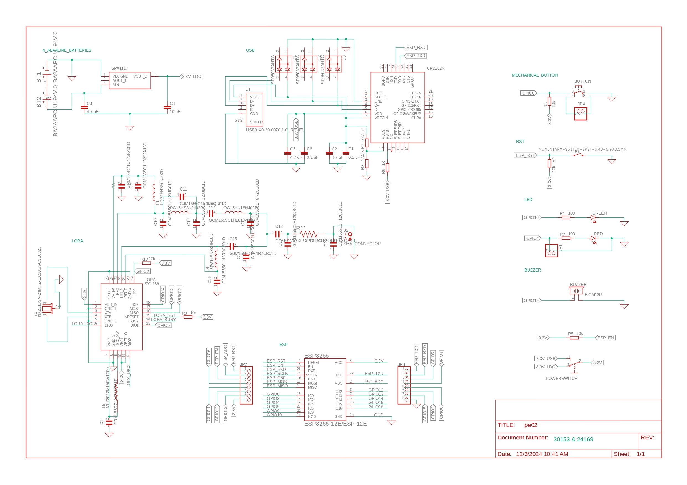
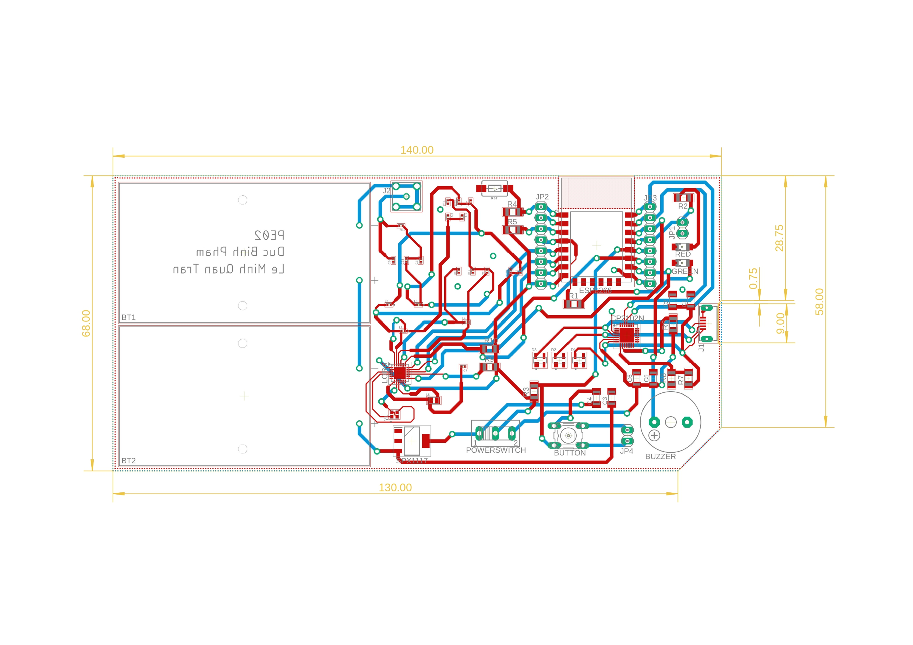
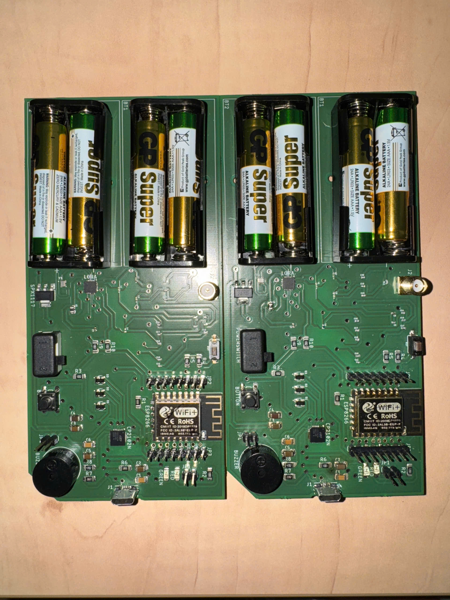

# Wireless Emergency Stop Button

by: Le Minh Quan Tran / Pham Duc Binh

**Faculty of Technology and Bionics**

***Rhine-Waal University of Applied Sciences***

Date: 13 January 2024

----

## Abstract

This project presents the design and implementation of a Wireless Emergency Stop Button (WESB)
 for enhancing safety in IoT applications, specifically the E-Go-Cart. 
 The WESB utilizes an ESP8266-based wireless communication link operating on a Wi-Fi network. 
 A mechanical button on the transmitter triggers an emergency stop signal, which is then transmitted 
 wirelessly to the receiver. The receiver is connected to the E-Go-Cart via a digital input/output interface. 
 Upon receiving the stop signal, the receiver initiates an emergency braking sequence implemented using MATLAB/Simulink, 
 bringing the E-Go-Cart to a safe halt within a defined distance. This system provides a reliable and efficient means 
 for remote emergency control of electric vehicles, improving overall safety and operational reliability.

## Table of Contents

[[_TOC_]]

## 1 Introduction

The increasing prevalence of electric vehicles (EVs), including those used in educational and recreational settings, 
demands robust safety mechanisms. This project addresses the need for a reliable and efficient emergency stop system for EVs,
 drawing inspiration from a real-world incident at Rhine-Waal University.

During a student festival, students were driving E-Go-Cart around campus under supervision. An accident occurred when a student, 
experiencing panic, lost control of their vehicle, potentially endangering pedestrians. Although the E-Go-Cart was equipped with 
an emergency stop button, the student's panicked state hindered their ability to react effectively. This incident underscored 
the limitations of traditional emergency stop mechanisms in high-stress situations and emphasized the need for a more robust and accessible solution.

Compared to traditional on-board emergency stop buttons, the WESB offers several advantages:

- Reduced Stress: Remote control eliminates the need for panicked individuals to locate and activate a specific button on the vehicle.
- Enhanced Accessibility: Integration with mobile applications provides convenient access to the emergency stop function.
- Centralized Control: The WESB allows for the simultaneous control of multiple vehicles, making it ideal for managing fleets or large-scale events.

This project seeks to address the shortcomings of existing safety measures and provide a more 
reliable and effective solution for ensuring the safe operation of electric vehicles in diverse settings.

## 2	Bill of Materials
| No. | Quality | Manufacturer               | Component               | Ordering code (manufacturer) | Vendor | Ordering code (vendor) | Price per unit (€) | Price (€)|
|:---:| :---:   | :---:                      | :---:                   | :---:                        | :---:  | :---:                  | :---:              | :---:    |
| 1   | 2       |                            | 2 AA cell holder        |                              | HSRW   |                        |                    |          |
| 2   | 1       |                            | PUSH BUTTON             |                              | HSRW   |                        |                    |          |
| 3   | 1       |                            | BUZZER                  |                              | HSRW   |                        |                    |          |
| 4   | 1       |                            | RED LED                 |                              | HSRW   |                        |                    |          |
| 5   | 1       |                            | GREEN LED               |                              | HSRW   |                        |                    |          |
| 6   | 1       |                            | POWER SWITCH            |                              | HSRW   |                        |                    |          |
| 7   | 1       | Diptronics                 | RESET BUTTON            |  DTSMF-32N-V-T/R             | Mouser | 113-DTSMF32NVTR        | 0.41               | 0.41     |
| 8   | 1       | Joy-IT                     | ESP8266                 | ESP8266-12F                  | Conrad | 1707668 - NA           | 4.19               | 4.19     |
| 9   | 1       | Semtech                    | RF Transceiver          | SX1268IMLTRT                 | Mouser | 947-SX1268IMLTRT       | 3.85               | 3.85     |
| 10  | 1       | Maxlinear                  | Voltage regulator       | SPX1117M3-L-3-3/TR           | Mouser | 701-SPX1117M3-L-33TR   | 0.49               | 0.49     |
| 11  | 1       | Silicon Laboratories       | USB Controller          | CP2102N-A02-GQFN28           | Mouser | 634-CP2102NA02GQFN28   | 3.28               | 3.28     |
| 12  | 1       | GlobalConnector Technology | Micro-usb header        | USB3140-30-0170-0-C          | Mouser | 640-USB31403001700C    | 0.75               | 0.75     |
| 13  | 1       | LPRS                       | RF Connector            | SMA CONNECTOR                | Mouser | 471-SMACONNECTOR       | 2.03               | 2.03     |
| 14  | 1       | Murata                     | RF Inductors - L1       | LQG15HS56NJ02D               | Mouser | 81-LQG15HS56NJ02D      | 0.09               | 0.09     |
| 15  | 1       | Murata                     | RF Inductors - L2       | LQG15HS8N2J02D               | Mouser | 81-LQG15HS8N2J02D      | 0.09               | 0.09     |
| 16  | 1       | Murata                     | RF Inductors - L3       | LQG15HN18NJ02D               | Mouser | 81-LQG15HN18NJ02D      | 0.09               | 0.09     |
| 17  | 1       | Murata                     | RF Inductors - L4       | LQW15AN33NH00D               | Mouser | 81-LQW15AN33NH00D      | 0.14               | 0.14     |
| 18  | 1       | TDK                        | Power Inductors - L5    | MLZ2012M150WT000             | Mouser | 810-MLZ2012M150WT000   | 0.11               | 0.11     |
| 19  | 1       | NDK                        | Crystals - Y1           | NX2016SA-32M-EXS00A-CS06465  | Mouser | 344-NX2016SA32S06465   | 0.52               | 0.52     |
| 20  | 1       |                            | Ceramic Capacitor - C1  |                              | HSRW   |                        |                    |          |
| 21  | 1       | KEMET                      | Ceramic Capacitor - C2  | C1206C475M4RACTU             | Mouser | 80-C1206C475M4R        | 0.88               | 0.88     | 
| 22  | 1       | KEMET                      | Ceramic Capacitor - C3  | C1206C475M4RACTU             | Mouser | 80-C1206C475M4R        | 0.88               | 0.88     | 
| 23  | 1       |                            | Ceramic Capacitor - C4  |                              | HSRW   |                        |                    |          | 
| 24  | 1       | KEMET                      | Ceramic Capacitor - C5  | C1206C475M4RACTU             | Mouser | 80-C1206C475M4R        | 0.88               | 0.88     |
| 25  | 1       |                            | Ceramic Capacitor - C6  |                              | HSRW   |                        |                    |          |
| 26  | 1       | Murata                     | Ceramic Capacitor - C7  | GRM155R71A474KE01D           | Mouser | 81-GRM155R71A474KE1D   | 0.36               | 0.36     |
| 27  | 1       | Murata                     | Ceramic Capacitor - C8  | GRM155R71C473KA01D           | Mouser | 81-GRM155R71C473KA01   | 0.09               | 0.09     |
| 28  | 1       | Murata                     | Ceramic Capacitor - C9  | GCM1555C1H820JA16D           | Mouser | 81-GCM1555C1H820JA6D   | 0.09               | 0.09     |
| 29  | 1       | Murata                     | Ceramic Capacitor - C10 | GJM1555C1H120JB01D           | Mouser | 81-GJM1555C1H120JB1D   | 0.12               | 0.12     |
| 30  | 1       | Murata                     | Ceramic Capacitor - C11 | GJM1555C1H3R6CB01D           | Mouser | 81-GJM1555C1H3R6CB1D   | 0.09               | 0.09     |
| 31  | 1       | Murata                     | Ceramic Capacitor - C12 | GJM1555C1H120JB01D           | Mouser | 81-GJM1555C1H120JB1D   | 0.12               | 0.12     |
| 32  | 1       | Murata                     | Ceramic Capacitor - C13 | GCM1555C1H101JA16D           | Mouser | 81-GCM1555C1H101JA6D   | 0.09               | 0.09     |
| 33  | 1       | Murata                     | Ceramic Capacitor - C14 | GJM1555C1H8R2CB01D           | Mouser | 81-GJM1555C1H8R2CB01   | 0.09               | 0.09     |
| 34  | 1       | Murata                     | Ceramic Capacitor - C15 | GJM1555C1H4R7CB01D           | Mouser | 81-GJM1555C1H4R7CB1D   | 0.09               | 0.09     |
| 35  | 1       | Murata                     | Ceramic Capacitor - C16 | GJM1555C1H3R9CB01D           | Mouser | 81-GJM1555C1H3R9CB1D   | 0.09               | 0.09     |
| 36  | 1       | Murata                     | Ceramic Capacitor - C17 | GJM1555C1H1R0BB01D           | Mouser | 81-GJM1555C1H1R0BB01   | 0.09               | 0.09     |
| 37  | 1       | Murata                     | Ceramic Capacitor - C18 | GCM1555C1H101JA16D           | Mouser | 81-GCM1555C1H101JA6D   | 0.09               | 0.09     |
| 38  | 1       | Murata                     | Ceramic Capacitor - C19 | GJM1555C1H120JB01D           | Mouser | 81-GJM1555C1H120JB1D   | 0.12               | 0.12     |
| 39  | 1       | Murata                     | Ceramic Capacitor - C20 | GJM1555C1H120JB01D           | Mouser | 81-GJM1555C1H120JB1D   | 0.12               | 0.12     |
| 40  | 3       | Littelfuse                 | TVS Diodes              | SP0503BAHTG                  | Mouser | 576-SP0503BAHTG        | 0.65               | 1.95     |
| 41  | 1       |                            | Resistor - R1           |                              | HSRW   |                        |                    |          |
| 42  | 1       |                            | Resistor - R2           |                              | HSRW   |                        |                    |          |
| 43  | 1       |                            | Resistor - R2           |                              | HSRW   |                        |                    |          |
| 44  | 1       |                            | Resistor - R4           |                              | HSRW   |                        |                    |          |
| 45  | 1       |                            | Resistor - R5           |                              | HSRW   |                        |                    |          |
| 46  | 1       |                            | Resistor - R6           |                              | HSRW   |                        |                    |          |
| 47  | 1       |                            | Resistor - R7           |                              | HSRW   |                        |                    |          |
| 48  | 1       |                            | Resistor - R8           |                              | HSRW   |                        |                    |          |
| 49  | 1       |                            | Resistor - R9           |                              | HSRW   |                        |                    |          |
| 50  | 1       |                            | Resistor - R10          |                              | HSRW   |                        |                    |          |
| 51  | 1       | Vishay                     | Resistor - R11          | CRCW04020000Z0ED             | Mouser | 71-CRCW0402-0-E3       | 0.09               | 0.09     |
| 52  | 2       |                            | 1x02 PIN HEADER         |                              | HSRW   |                        |                    |          |
| 53  | 2       |                            | 1x08 PIN HEADER         |                              | HSRW   |                        |                    |          |

## 3	Methodology

### 3.1     Schematic
Final Schematic:

 Figure 1: Schematic

### 3.2     PCB Design
Final PCB:

 Figure 2: PCB design

### 3.3     Prototyping

### 3.4     Assembly Process

#### 3.4.1 Soldering SMD components
First step: Use a stencil and apply solder paste to PCB.

 Figure 3: Using a stencil

After applying solder paste, pick up all SMD components and make sure they are all in correct place.

 Figure 4: Put on SMD components

Next, put PCB into the oven then bake it. The setup was supported by Mr. Muh.

 Figure 5: Put PCB into the Oven

 Figure 6: Baking PCB

Last but not least, test the connectivity of the SMD components with the multimeter.

#### 3.4.2 Soldering THT components
Solder THT components with Solder pen.

 Figure 7: Solder THT components

Same as SMD components, make sure all THT components are connected appropriately.

## 4    Programming and uploading firmware
We programmed the ESP8266 chips using Arduino IDE and PlatformIO.
The files of Transmitter and Receiver are in the ***code/Official code*** folder.

## 5    Troubleshooting
**[1]**
Can power the ESP8266 by USB cable, but not able to program. The device manager from the laptop cannot detect the USB port, although
download a correct driver.

**[2]**
Able to prototype LoRa module, but difficult to implement in the project. There have to be hard-work programming and deep understand in
RF functions.

**[3]**
Able to program the ESP8266 chips by using FDTI FT232RL Module. However, when the ESP8266 chips were soldered to the PCB, we could not
program them by using FDTI module anymore.

## 6	Results
This is the result:
 Figure 8: Final Products

## 7	Power Consumption and Battery Life
**Power Consumption**
V_supply = 6V (measured)
I_output = 200mA (measured)
⇒ P_consumed = V_supply * I_output = 5.5V * 200mA = 1200 mW.
**P_consumed = 1200 mW**

**Battery Life**
Battery capacity of AAA Alkaline: 1200 mAh (datasheet)
Battery Life = 1200mAh / 200mA = **6 hours**

## 8	Further Improvements
- **Integration with Other Devices:** Integrate wireless e-stops with other E-Carts or Robots to create a comprehensive safety network.
- **Further Program Development:** Sleep mode to optimize the battery life
- **Application of The Lora Module** to increase distance and reliable communication. 
- **Ergonomic Design:** Ensure ergonomic design for comfortable and intuitive operation (Push button, battery level, signal strength,…)

## 9	References

* [1] ESP32 with LoRa using Arduino IDE – Getting Started (https://randomnerdtutorials.com/esp32-lora-rfm95-transceiver-arduino-ide/)
* [2] CP2102N (https://www.mouser.de/datasheet/2/368/cp2102n_datasheet-1634912.pdf)
* [3] ESP-12E WiFi Module (https://components101.com/sites/default/files/2021-09/ESP12E-Datasheet.pdf)
* [4] ESP8266 - Button - Piezo Buzzer (https://newbiely.com/tutorials/esp8266/esp8266-button-piezo-buzzer)
* [5] Configure an ESP8266 as a WiFi Access Point
* [6] CP2102N Driver (https://www.silabs.com/developer-tools/usb-to-uart-bridge-vcp-drivers?tab=overview)
* [7] Best battery for ESP32 (https://diyi0t.com/best-battery-for-esp32-nodemcu/)
* [8] Tips for ESP8266 (https://www.instructables.com/ESP8266-Pro-Tips/)
* [9] Electronic Component Search Engine (https://componentsearchengine.com/)
